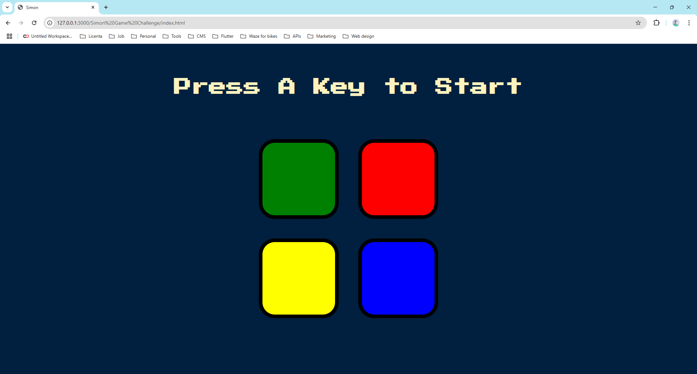
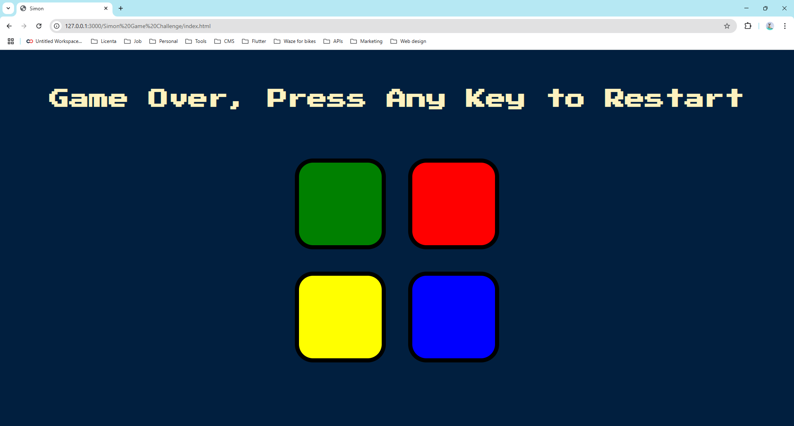

# Memory Game 
Simple memory game written in JavaScript. The user has to replicate the pattern to move to the next level, if he gets one button wrong, the game ends.

# Game Preview

  

# Game Over

  

